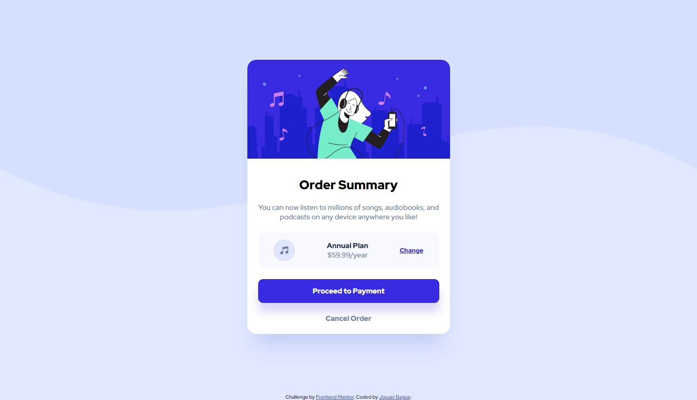
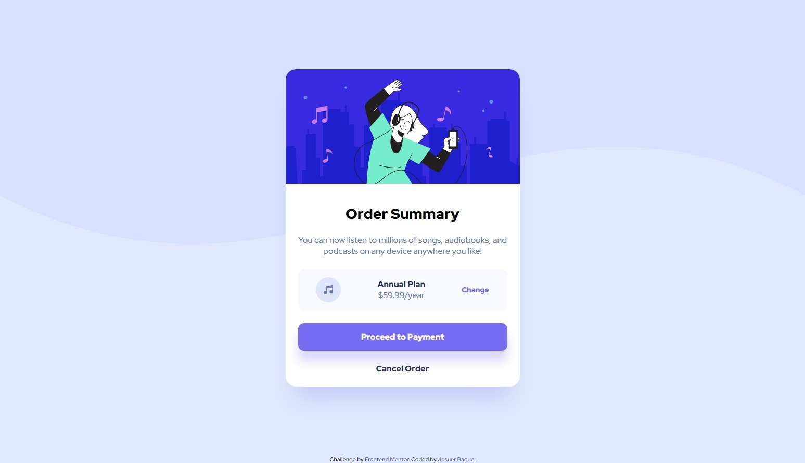
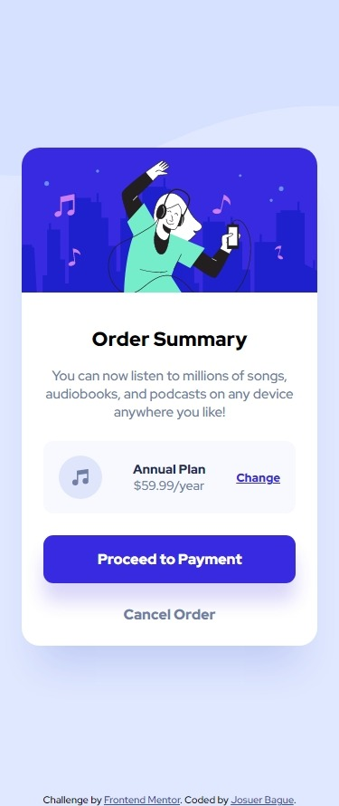

# Frontend Mentor - Order summary card solution

This is a solution to the [Order summary card challenge on Frontend Mentor](https://www.frontendmentor.io/challenges/order-summary-component-QlPmajDUj). Frontend Mentor challenges help you improve your coding skills by building realistic projects. 

## Table of Contents

- [Overview](#overview)
  - [The challenge](#the-challenge)
  - [Screenshot](#screenshot)
  - [Links](#links)
  - [Built with](#built-with)
  - [What I learned](#what-i-learned)
- [Author](#author)

## Overview

### The challenge

Users should be able to:
    - See hover states for interactive elements.

### Screenshots

Desktop View:

Desktop View - Active:

Mobile View:

### Links

- Solution URL: [Github Repo](https://github.com/JoshDagat/FM-Order-Summary)
- Live Site URL: [Live Sample](https://joshdagat.github.io/FM-Order-Summary/)

### Built With

- HTML
- Flexbox
- Mobile-first approach

### What I learned

I came upon a great article about [Fluid Typography](https://css-tricks.com/snippets/css/fluid-typography/) here. I used this in my project to help with responsive text.

## Author

- LinkedIn - [Josuer Bague](https://www.linkedin.com/in/josuer-bague/)
- Frontend Mentor - [FM Josuer Bague](https://www.frontendmentor.io/settings)